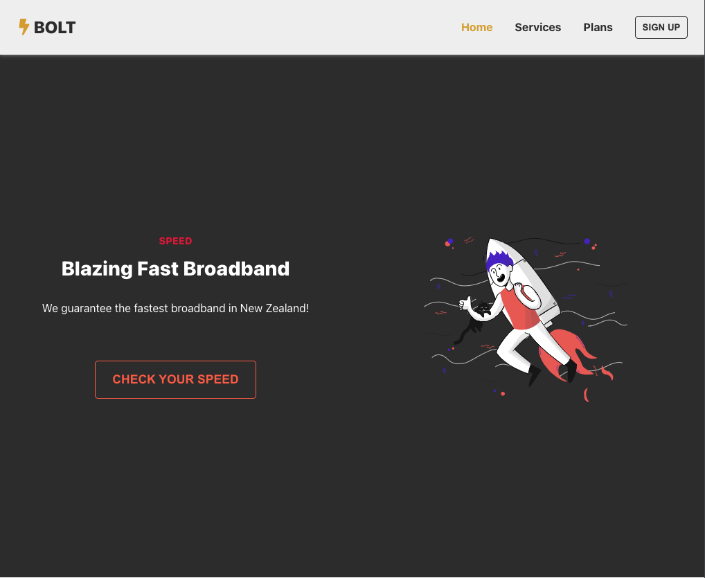

# 4. Bolt Broadband (React.js)

## Screenshots

## Features

- Use components and data files to reproduce components with different styles and contents :

  → Hero

  → Button

  → Pricing Cards

  → Sub Headers

- Use `Redux Toolkit` (instead of `Context API`) to share :

  → desktop/mobile status (isMobileStatus)

  → menu button open/close status (menuBtnStatus)

- Use `Sass(SCSS)` instead of `CSS`.

- Sub Header section for each pages (except Home page).

- Navbar

  → Glassmorphism effect on scroll

- Animation

  → Play animation on hover

## Skills

- HTML
- Sass/SCSS
- JS
- React.js
- Redux Toolkit
- Lottie (animated illustration)
- React Icons
- Components with separate data files
